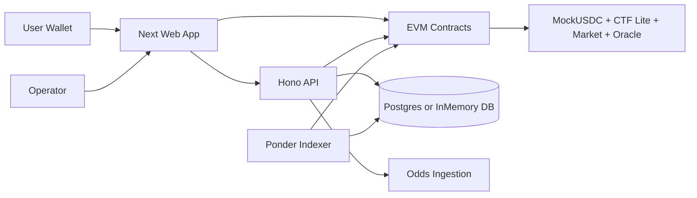
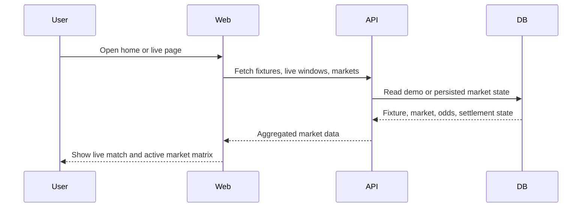
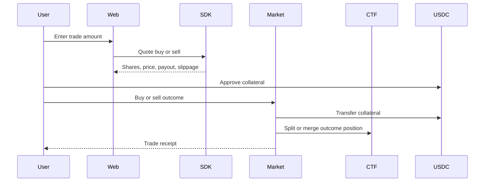
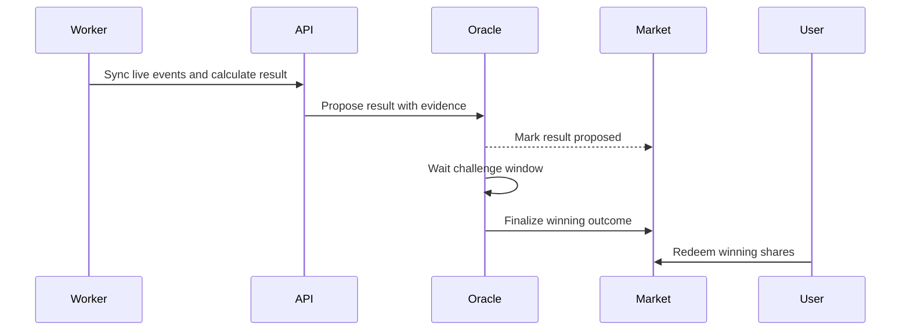
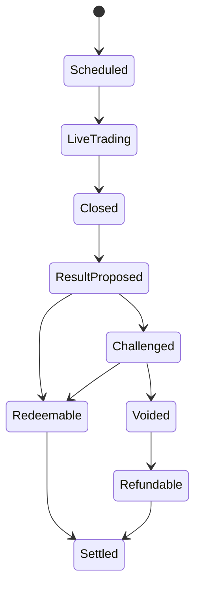

# World Cup Prediction Market

2026 世界杯 EVM 实时滚球预测市场。项目以 Polymarket/UMA/CTF 风格为长期架构方向，当前实现覆盖本地 Anvil、Mock USDC、简化条件代币、乐观结算、API、索引器、Web 前端和测试脚本，目标是验证一条完整的 live window 交易到赎回闭环。

> 当前版本仍是测试网/本地验证项目。Mock USDC 没有真实价值，页面展示概率不是博彩建议，结算以市场规则和最终 oracle 结果为准。

## 架构总览



核心模块：

- `apps/web`：Next.js 前端，展示首页、Live Markets、市场详情、持仓、结算中心、运营台，并支持 H5 响应式布局。
- `apps/api`：Bun + Hono API，提供 public/admin/commercial routes、OpenAPI 文档、市场和结算服务。
- `apps/indexer`：Ponder 索引器，监听链上市场、交易、结算事件并写回数据库状态。
- `contracts`：Foundry 合约包，包含 `MockUSDC`、`ConditionalTokensLite`、`WorldCupMarketFactory`、`WorldCupMarket`、`OptimisticResultOracle`。
- `packages/db`：迁移、数据库 facade、Postgres/InMemory repository 和 seed 数据。
- `packages/shared`：共享类型、常量、校验、商业市场与结算 helper。
- `packages/sdk`：API client、chain client、market quote helper。
- `packages/odds-ingestion`：demo odds provider、odds normalizer 和 provider odds 对比逻辑。
- `packages/config`：chain、contract、market 配置。

## 主流程

### 1. 市场发现



用户从首页、赛程页或 Live Markets 进入市场详情，查看比赛时间、比分、窗口起止、Yes/No outcome、数据质量、外部 odds 偏离和 oracle 状态。

### 2. 买入和卖出 outcome shares



前端展示预估 shares、平均价格、潜在 payout、滑点和禁用原因。当前本地路径使用 Mock USDC，链上金额和 shares 使用 raw bigint/string 表示。

### 3. 结果提交、挑战和结算



窗口关闭后，数据服务根据确认事件计算 winning outcome，并提交 evidence。challenge window 内可挑战；无人挑战或争议处理完成后 finalize，获胜 shares 可赎回。

### 4. 运营和风控

运营台负责 feature flags、risk limits、provider health、market pause/resume、void/refund、challenge review 和 audit logs。数据源延迟、盘口偏离、fixture mismatch 等异常会触发 review 或暂停逻辑。

## 市场状态



第一条端到端路径围绕 `Brazil vs Morocco, 63:00-73:00 - will either team score a goal?` 的 Yes/No live goal window 展开。

## 项目结构

```text
worldcup-prediction-market/
  apps/
    api/       Bun + Hono API and OpenAPI docs
    indexer/   Ponder event indexing
    web/       Next.js frontend
  contracts/   Foundry Solidity contracts, scripts, tests
  packages/
    config/          Shared chain and market config
    db/              Migrations, DB client, repository, seed
    odds-ingestion/  Odds providers, normalizers, comparisons
    sdk/             API, chain, market quote helpers
    shared/          Domain types, constants, validation
  scripts/      Cross-package test and flow scripts
  docs/         Product, development, testing, data source docs
```

## 本地开发

安装依赖：

```bash
bun install
```

常用服务：

```bash
bun run dev:web
bun run dev:api
bun run dev:indexer
bun run dev:anvil
```

本地部署合约：

```bash
bun run deploy:local
```

数据库：

```bash
bun run db:migrate
bun run db:seed
bun run db:backup
```

生产环境除逻辑备份外，还应启用托管数据库自带的自动备份 / PITR；详见 `docs/development.md` 中「数据库备份与恢复」。

## 测试和验证

```bash
bun run typecheck
bun run lint
bun run test
bun run coverage
```

常用定向验证：

```bash
bun --cwd apps/web test
bun run test:web:responsive
bun run test:contracts
bun run test:e2e:anvil
bun run test:commercial-matrix
bun run test:security
bun run test:performance
```

`test:web:responsive` 会启动 Next dev server，并用 H5 视口检查主要页面没有横向溢出。

## 文档入口

- 产品与技术方案：`docs/worldcup-2026-evm-prediction-market.md`
- 开发文档：`docs/development.md`
- 测试策略：`docs/testing.md`
- 数据源策略：`docs/data-sources.md`
- 结算规则：`docs/resolution-rules.md`
