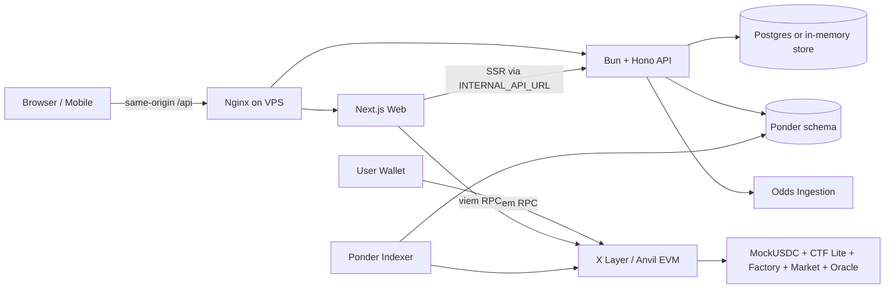
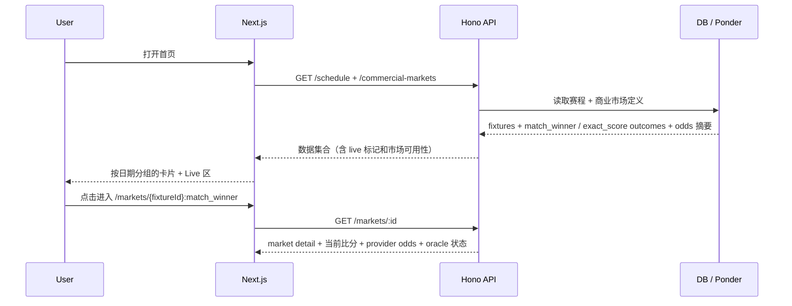
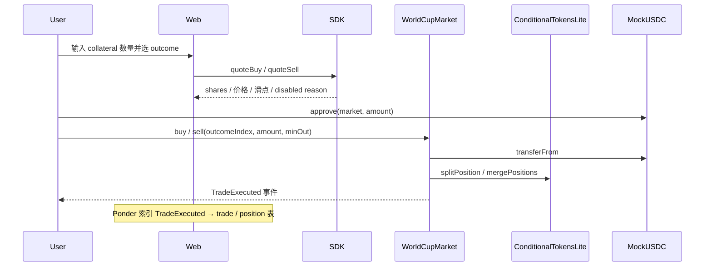
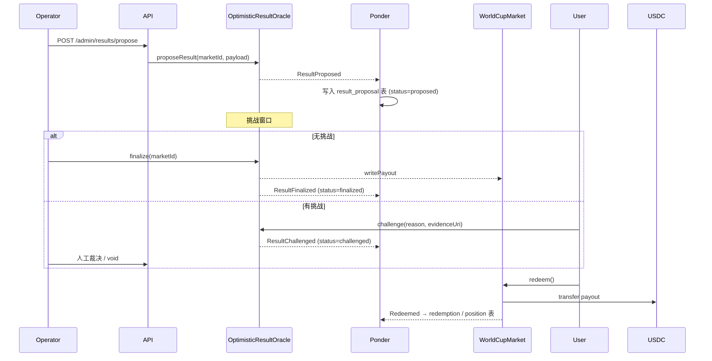
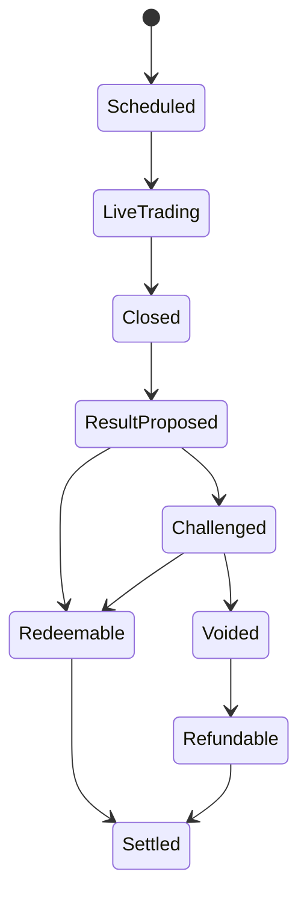

# polygoal

2026 世界杯 EVM 预测市场。当前主线是「比赛胜负 + 比分」两类商业市场（`match_winner` / `exact_score`），架构对标 Polymarket / UMA / CTF：链上 binary（match_winner 为 3 选 1）outcome shares、乐观结算预言机、Ponder 索引器、Bun + Hono API 和 Next.js 前端。

本仓库同时支持三套运行形态：

- 本地 Anvil + Mock USDC，跑完整端到端。
- 远端 X Layer Testnet（chain id `1952`），已部署一组 World Cup 2026 小组赛 `match_winner` 市场（地址见 `deployments/xlayer-testnet.json`）。
- VPS 公网前端 + 本地 / VPS 同机 API 的「方案 A」部署，浏览器统一走 `/api/*` 同源路径，由 nginx 反代到本地 API。

> 当前仍是测试网/演示版本。Mock USDC 没有真实价值，展示概率不是博彩建议，结算以市场规则和最终 oracle 结果为准。历史的 goal-window 滚球市场已不再作为用户可见入口（见 `docs/match-winner-first-requirements.md`），相关合约和测试代码作为底层基础设施保留。

## 架构总览



核心模块：

- `apps/web`：Next.js 前端，比赛优先的信息架构。页面：首页（赛程 + Live）、`/markets/[marketId]`、`/matches/[fixtureId]`（重定向到 `match_winner`）、`/portfolio`、`/settlements`、`/operator`。UI 基于 React 19 + Tailwind v4 + HeroUI v3（`@heroui/react`）：所有卡片型容器统一使用 `<Card>`，状态徽标使用 `<Chip>`，主题色 token（`--accent` / `--success` / `--radius` 等）在 `app/globals.css` 内被覆盖为品牌绿 `#05b34f`。
- `apps/api`：Bun + Hono API，提供 public / admin / commercial 路由、OpenAPI 文档、市场服务，以及 `services/ponder-reader.ts` 读取 Ponder 索引产生的 `trade / market / result_proposal` 表。
- `apps/indexer`：Ponder 0.16，配置见 `apps/indexer/ponder.config.ts`（默认链：X Layer Testnet，factory / oracle 地址来自 `deployments/xlayer-testnet.json`）。事件处理器 `src/index.ts`，schema `ponder.schema.ts`。旧的事件处理器保留在 `legacy/` 仅供参考。
- `contracts`：Foundry 合约（`MockUSDC` / `ConditionalTokensLite` / `WorldCupMarketFactory` / `WorldCupMarket` / `OptimisticResultOracle`）。
- `packages/db`：单一 migration `001_mvp_schema.sql`、Postgres / InMemory facade、seed。
- `packages/shared`：类型、常量、商业市场 helper，新增 `deployments.ts`、`worldcup-2026-schedule.ts`、`getXLayerMarketDeployment(...)`。
- `packages/sdk`：API client、chain client、market quote helper。
- `packages/odds-ingestion`：odds provider、normalizer、对比逻辑。
- `packages/config`：链 / 合约 / 市场配置。
- `scripts/`：跨包脚本，新增 `deploy-xlayer-infra.ts` / `deploy-xlayer-markets.ts` / `deploy-vps-ip-http.sh` / `seed-demo-portfolio.ts`。

## 主流程

### 1. 市场发现



用户路径：

- 首页只展示「比赛」，每场比赛卡片标注是否有 `match_winner` / `exact_score`。
- 进入市场详情页默认展示 `Match Winner` 面板（3 选 1：Home / Draw / Away）。`Exact Score` 作为次级 tab。
- 直接访问 `/matches/[fixtureId]` 自动重定向到 `match_winner` 市场。

### 2. 买卖 outcome shares



前端展示预估 shares、平均价格、潜在 payout、滑点和禁用原因。链上金额一律使用 raw bigint / string。

### 3. 结果提交、挑战与结算



API 的 `/portfolio/:wallet` 和 `/settlements` 在 Ponder schema 可用时直接读 indexer 表；不可用时回退到内存 / Postgres facade，避免演示数据污染真实链上数据。

### 4. 运营与风控

运营台 `/operator` 在 `NEXT_PUBLIC_OPERATOR_CONSOLE_ENABLED=true` 时挂载。覆盖：feature flag、risk limit、provider health（含 auto-pause）、市场暂停 / 恢复、challenge 审批、void / refund 队列、audit log。详见 `apps/api/src/routes/commercial.ts`。

## 市场状态机



API 把 `oracle_state` 与 `market_status` 解耦：Ponder 读到 `proposed / challenged / finalized / voided` 时覆盖 in-memory 的默认 `live_trading`，让 UI 同时反映赛事进程和链上裁决。

## 项目结构

```text
polygoal/
  apps/
    api/        Bun + Hono API、OpenAPI、market/risk/operator 服务、ponder reader
    indexer/    Ponder（ponder.config.ts / ponder.schema.ts / src/index.ts，legacy/ 仅供参考）
    web/        Next.js 前端，新版页面结构
  contracts/    Foundry Solidity 合约 + 脚本 + 测试
  deployments/  xlayer-testnet.json：infra + 已部署的小组赛 match_winner 市场
  packages/
    config/         链 / 合约 / 市场配置
    db/             单一 migration、in-memory + Postgres facade、seed
    odds-ingestion/ provider / normalizer / 对比
    sdk/            api / chain / market quote 封装
    shared/         类型、常量、商业市场 helper、deployments helper、worldcup-2026 赛程
  scripts/      跨包验证 + 部署脚本（X Layer、VPS、demo seed）
  docs/         产品 / 开发 / 测试 / 数据源 / 部署文档
```

## 本地开发

安装依赖：

```bash
bun install
```

最少需要 4 个进程（不同终端各跑一个，或后台启动）：

```bash
bun run dev:anvil      # 本地链 (chainId 31337)
bun run dev:api        # http://localhost:8787
bun run dev:web        # http://localhost:3000，浏览器走 /api → next rewrite → API
bun run dev:indexer    # Ponder（连接 .env 中的 RPC 与 DATABASE_URL）
```

部署本地合约 + 配置 `.env`：

```bash
bun run deploy:local                  # forge script Deploy.s.sol
# 或一键端到端（部署 + seed + 跑流程）
bun scripts/contracts-full-flow.ts
```

数据库：

```bash
bun run db:migrate
bun run db:seed
bun run db:backup                     # pg_dump 到 BACKUP_DIR（默认 ./backups/pg）
```

商业 / 演示 portfolio seed（针对某个钱包灌入跨状态持仓与结算记录）：

```bash
bun run seed:demo-portfolio --wallet=0xABC...
```

## 部署到 X Layer Testnet

`scripts/deploy-xlayer-infra.ts` 部署底层合约（MockUSDC / CTF / Oracle / Factory），`scripts/deploy-xlayer-markets.ts` 用共享的 `WORLDCUP_2026_GROUP_STAGE_FIXTURES` 创建一组 `match_winner` 市场。两个脚本都会回写 `deployments/xlayer-testnet.json`，前端、Ponder 配置和 API 都直接读这份单一 source of truth。

```bash
PRIVATE_KEY=0x... bun run deploy:xlayer:infra
PRIVATE_KEY=0x... bun run deploy:xlayer:markets
```

## 部署到 VPS（同源 `/api` 反代）

```bash
DEPLOY_HOST=YOUR_VPS_IP ./scripts/deploy-vps-ip-http.sh
```

脚本会 rsync 仓库到 VPS，远端 `scripts/deploy-vps-remote-provision.sh` 执行：

1. 安装 `nginx` / `bun` / Node 20（NodeSource）；分配 `/swapfile-polygoal` 4G。
2. `bun packages/db/src/seed.ts` 重放 `001_mvp_schema.sql` 并写入 demo 数据。
3. `cd apps/web && NODE_OPTIONS=--max-old-space-size=2048 bun run build`（注入 `NEXT_PUBLIC_*` 含 X Layer 合约地址）。
4. 写入并启动三个 systemd unit：
   - `polygoal-indexer.service` — `bun x ponder start --schema ponder`，索引 X Layer Testnet。
   - `polygoal-api.service` — `bun apps/api/src/server.ts`，监听 `127.0.0.1:8787`，`PONDER_SCHEMA=ponder`。
   - `polygoal-web.service` — `node next start -H 127.0.0.1 -p 3000`（Bun + Next 16 RSC 会崩，必须用 Node 20）。
5. 写入 `/etc/nginx/sites-available/polygoal.conf`：浏览器 `/api/*` → `127.0.0.1:8787`，`/` → `127.0.0.1:3000`，并跑 `curl /health` + `/api/health` smoke。

同源 `/api` 同时绕开跨域和 Chrome PNA；API 仍在 OPTIONS preflight 上兜底 `Access-Control-Allow-Private-Network: true`。完整流程、环境变量、故障排查见 `docs/deploy-scheme-a-public-frontend-local-api.md`。

## 测试与验证

```bash
bun run typecheck
bun run lint
bun run test
bun run coverage
```

常用定向验证：

```bash
bun --cwd apps/web test
bun run test:web:responsive          # 多视口启动 Next dev server 检查横向溢出
bun run test:contracts
bun run contracts:flow               # Solidity-only 端到端流程（不依赖 Anvil 守护进程）
bun run test:e2e:anvil               # 真 Anvil + 部署 + DB + API + 索引器
bun run test:commercial-matrix
bun run test:security
bun run test:performance
bun run test:postgres                # 真 Postgres 集成
bun run test:report                  # 汇总报告
```

## 文档入口

- 产品 / 技术方案：`docs/worldcup-2026-evm-prediction-market.md`
- 开发文档：`docs/development.md`（含测试策略、coverage、review-fix 循环）
- 数据源策略：`docs/data-sources.md`
- 结算规则：`docs/resolution-rules.md`
- 比赛胜负优先产品需求：`docs/match-winner-first-requirements.md`
- 同源 `/api` VPS 部署：`docs/deploy-scheme-a-public-frontend-local-api.md`
