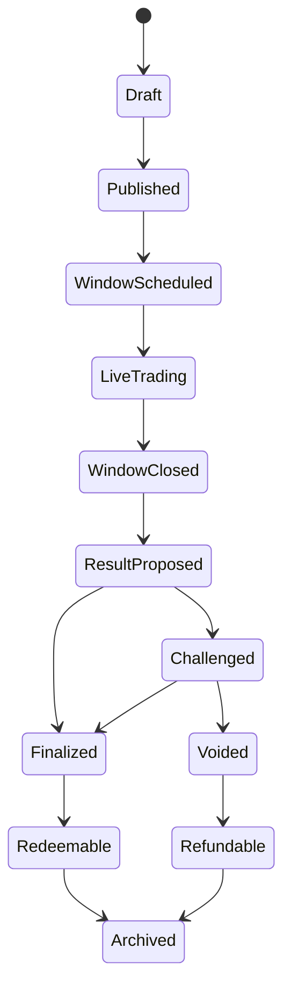
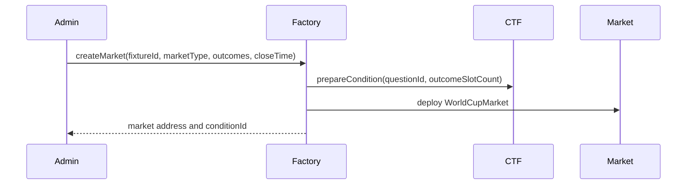
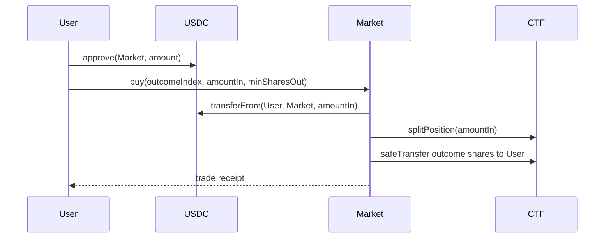
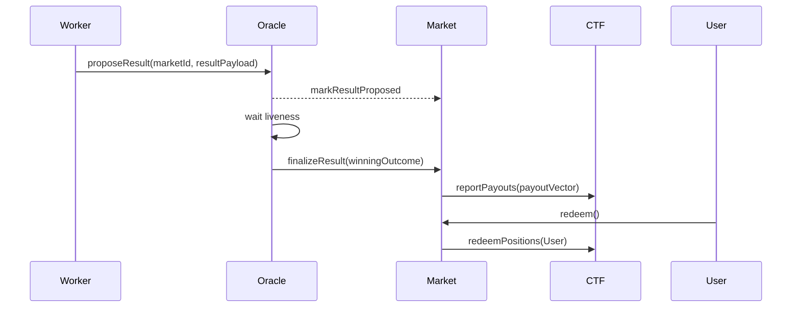

# 2026 世界杯 EVM 预测市场产品与技术方案

## 1. 项目定位

本项目是一个面向 2026 FIFA World Cup 的商业级 EVM 预测市场 DApp。产品体验对标成熟足球竞猜站的信息密度、交易速度和视觉完成度；市场机制对标 Polymarket 的事件市场、outcome shares、可交易概率、透明结算和可争议 oracle 流程。

文档目标从 MVP 升级为商业可运行版本。系统需要支持四套环境：

- **local**：Anvil + Mock USDC 跑完整闭环。
- **X Layer Testnet (1952)**：已部署一组 World Cup 2026 小组赛 `match_winner` 市场，作为公开演示环境。详见 `deployments/xlayer-testnet.json` 和 `scripts/deploy-xlayer-*.ts`。
- **staging**：商业 rehearsal，多签 + 真实 provider + UMA / adapter 排练。
- **production**：合规链 + multi-provider + UMA / CTF + 多签运营。

商业版本需要具备真实抵押资产接入、数据源冗余、风控、运营后台、监控告警、审计、合规开关和精美前端体验。

本方案按 **方案 C：UMA / CTF 类 Polymarket 架构** 落地。产品主线在 2026-05 调整为 **「比赛胜负优先 + 比分预测次级」**（见 `docs/match-winner-first-requirements.md`）：

- 主市场：`match_winner`（3 选 1：Home / Draw / Away），全场常规时间结算。
- 次级市场：`exact_score`（常见比分 + `Other score`）。
- 历史的 goal-window 滚球市场（`goal_window_5m/10m/15m`、`next_goal_team`、`live_goal_window`）作为底层能力保留，合约和测试链路仍然存在；但 UI、首页、Live Markets、市场详情都不再以 goal-window 作为主入口。
- 用 Conditional Tokens Framework 思路表示 outcome shares。
- 用乐观预言机流程提交赛果，保留 challenge window、bond、争议升级和人工运营兜底。
- 本地版用简化 CTF/UMA 适配器；商业版必须保持可升级到 UMA Optimistic Oracle 与 Gnosis CTF。

## 2. 产品目标

### 2.1 核心目标

- 拉取 2026 世界杯基础赛程、球队、场馆、比赛状态、实时比分和关键事件。
- 为每场比赛创建一对核心商业市场：`match_winner` 与 `exact_score`。
- 支持用户用测试网资产（local / X Layer Testnet 上的 Mock USDC）或合规环境下的稳定币抵押资产购买和卖出 outcome shares。
- 比赛结束后由数据服务提交结果，经过挑战期、bond 和争议流程后结算。
- 用户可赎回获胜 outcome shares 对应的抵押资产。
- 前端以商业产品标准展示正在进行的比赛、胜负与比分两个产品 tab、实时赔率 / 概率、盘口偏离、持仓、结算、风险规则和数据可信度，并保持「比赛优先」的信息架构。

### 2.2 非目标

本地验证版本暂不做以下内容，但商业版本需要在路线中覆盖或明确关闭：

- 真实资金主网交易。
- KYC、AML、地理限制和博彩合规完整实现。
- 串关、让球、大小球、球员数据盘。
- 完整订单簿撮合系统。
- 生产级 UMA DVM 争议仲裁集成。

这些能力作为后续版本路线保留。

### 2.3 商业版本能力目标

商业可运行版本必须具备：

- **市场矩阵**：以 `match_winner` 与 `exact_score` 为主线，覆盖 World Cup 2026 全部小组赛 + 淘汰赛；goal-window 等滚球市场作为底层能力保留，必要时通过 feature flag 重新打开。
- **数据源冗余**：FIFA 官方数据、至少两个体育数据 provider、链上 oracle、人工运营复核后台。
- **真实盘口数据**：从专业 odds provider 拉取赛前与 live 1X2 / correct score 盘口，并保留来源、bookmaker、时间戳和水位变化。
- **交易体验**：毫秒级前端状态刷新、清晰滑点、预估 payout、交易确认、失败恢复、持仓盈亏、批量 redeem。
- **流动性体系**：官方初始流动性、LP 仪表盘、库存风险监控、市场深度和费用模型。
- **风控体系**：比赛事件延迟保护、交易关闭 buffer、异常赔率保护、数据冲突阻断、盘口暂停、单用户限额。
- **运营后台**：赛程数据审核、市场批量创建、市场暂停、结果提交、challenge 处理、void / refund、数据源对比，所有动作写 audit log。
- **合规开关**：地域限制、风险提示、真实资产开关、仅测试网模式、受限国家访问阻断。
- **商业前端**：高完成度视觉系统、响应式布局、暗色主题、赛事氛围、可访问性和移动端优先体验。
- **公网可访问性**：浏览器统一走 `/api/*` 同源路径（local 由 Next rewrite，VPS 由 nginx 反代），避免 CORS / Chrome Private Network Access 屏蔽。
- **链上状态可观测**：所有市场事件由 Ponder 索引到独立 `ponder` schema；API 在该 schema 可用时优先返回真链上数据。
- **生产运维**：监控、告警、日志、审计 trail、SLO、事故响应 runbook。

## 3. 用户角色

### 3.1 普通用户

普通用户是预测市场参与者。他们连接钱包，领取测试网 Mock USDC，浏览世界杯赛程和市场，购买 outcome shares，查看持仓，并在市场结算后赎回收益。

普通用户需要的能力：

- 快速找到自己关心的球队和比赛。
- 理解市场题目、选项和结算规则。
- 看到 outcome 当前价格、概率和流动性。
- 购买或卖出 outcome shares。
- 跟踪持仓盈亏。
- 在结算后领取 payout。

### 3.2 流动性提供者

流动性提供者为市场注入初始资金，使用户可以交易。本地验证可由管理员账户或测试脚本扮演流动性提供者，商业版本需要独立 LP 仪表盘、费用模型和库存风险监控。

流动性提供者需要的能力：

- 为新市场添加初始流动性。
- 查看市场总 TVL、交易量、费用和库存风险。
- 市场关闭后取回剩余资金或领取 LP 收益。

### 3.3 数据运营/管理员

管理员负责数据同步、市场发布、结果提交和争议处理。本地版本可由项目方地址控制，商业版本必须拆分数据运营、市场运营、风控、结算审核等角色。

管理员需要的能力：

- 导入和校验赛程、球队、live 比赛状态和实时事件。
- 为 live window 创建市场。
- 暂停异常市场。
- 提交赛果。
- 在挑战期处理争议。
- 重新同步 live 比赛状态和事件。

### 3.4 挑战者

挑战者可以在赛果提交后、结算前提出挑战。早期版本挑战者可以是白名单地址，商业版本应开放质押保证金 challenge，并支持争议升级。

挑战者需要的能力：

- 查看处于 challenge window 的市场。
- 对错误进球事件、错误窗口结果或错误 outcome 提出 challenge。
- 提供证据链接或数据源引用。
- 等待仲裁或管理员裁决。

## 4. 核心用户流程

### 4.1 浏览和发现市场

1. 用户进入首页 `/`。
2. 首页按日期分组展示 World Cup 2026 赛程；正在进行（`live`）的比赛单独排在最上方；每张比赛卡片标注是否有 `match_winner` / `exact_score` 市场可交易。
3. 用户点击比赛卡片直达市场详情页 `/markets/{fixtureId}:match_winner`（或访问 `/matches/{fixtureId}` 自动重定向）。
4. 默认展示 `Match Winner` 面板（3 选 1：Home / Draw / Away）；通过次级 tab 切换到 `Exact Score`（常见比分 + `Other score`）。
5. 用户在同一屏看到比分、kickoff、窗口、当前概率、provider odds、链上市场偏离、结算规则和实时事件。

成功标准：

- 用户在 1–2 次点击内进入任意比赛的 match_winner 市场。
- 所有市场都能显示明确状态：scheduled / live_trading / closing_soon / closed / proposed / challenged / redeemable / settled / voided。
- 不存在让普通用户先理解 goal-window 的入口。

### 4.2 购买 outcome shares

1. 用户连接钱包。
2. 用户领取或准备测试网 Mock USDC。
3. 用户选择市场 outcome，例如“Argentina wins”。
4. 前端展示预计获得 shares、平均价格、最大滑点和潜在 payout。
5. 用户授权 Mock USDC。
6. 用户提交交易。
7. 合约转入抵押资产，铸造或转移 outcome shares 给用户。
8. 前端更新持仓。

成功标准：

- 用户可以明确看到“我花多少 USDC，获得多少 shares，如果该 outcome 获胜可赎回多少”。
- 交易失败时能给出可理解错误：余额不足、授权不足、市场已关闭、滑点过高等。

### 4.3 卖出 outcome shares

1. 用户打开市场详情页或持仓页。
2. 用户选择卖出某个 outcome shares。
3. 前端展示预计收到 Mock USDC、价格影响和手续费。
4. 用户提交交易。
5. 合约扣减 shares，返还 Mock USDC。

成功标准：

- 用户能在滚球窗口关闭前退出或调整仓位。
- 窗口已关闭、挑战中、已结算市场不能继续交易，只能赎回或等待。

### 4.4 赛果提交与乐观结算

1. 比赛结束（FT）后，数据同步服务从体育数据 API 拉取最终比分与关键事件。
2. result worker 根据结算规则计算 winning outcome（`match_winner` 用「常规时间」结果，`exact_score` 用最终比分匹配，未列出比分归入 `Other score`）。
3. 通过 `POST /admin/results/propose` 调用 `OptimisticResultOracle.proposeResult(...)`，提交 evidence URI、payload hash 与 winning outcome。
4. 市场进入 challenge window；Ponder 索引到 `ResultProposed` 后把 `result_proposal.status` 置为 `proposed`，API `/settlements?status=proposed` 与前端 `/settlements` 同步更新。
5. 无人挑战 → 任何人可调用 `finalize(...)`；事件 `ResultFinalized` 被 Ponder 收到后状态变为 `finalized`，API `getMarketStatusOverlay` 把市场状态覆盖为 `redeemable`。
6. 有人挑战 → 市场进入 `challenged`；早期版本由管理员裁决并写 audit log，商业版本可升级到 UMA Optimistic Oracle / DVM。
7. void 路径：`POST /admin/markets/:id/void` → `MarketVoided` → Ponder `status = voided` → `/admin/markets/:id/refund` 排队退款。
8. 市场 finalized 后，用户在 `/portfolio` 点击 redeem。

成功标准：

- 比赛结束后能自动进入待结算队列。
- 提交结果链上可追溯（Ponder 全量索引 + 事件 hash）。
- 结算规则可读、可验证、可复现。
- 错误结果有挑战入口。

### 4.5 赎回

1. 市场 finalized。
2. 用户在持仓页看到“可赎回”。
3. 用户点击 redeem。
4. 合约 burn 或锁定用户获胜 outcome shares。
5. 用户按 payout ratio 领取 Mock USDC。

成功标准：

- 失败 outcome shares payout 为 0。
- 获胜 outcome shares payout 为 1 share 对应 1 单位 collateral，或按市场定义的 payout vector 计算。
- 用户可以批量赎回多个市场。

## 5. 市场类型设计

商业版本主线是 **`match_winner` + `exact_score`** 两类市场。两者共享统一的 market metadata、close time、oracle payload、challenge 和 redeem 流程。

### 5.1 主市场：Match Winner（胜负平）

示例题目：

> Who will win Brazil vs Morocco?

Outcomes：

- `Home`（例：Brazil）
- `Draw`
- `Away`（例：Morocco）

`market_key`：`fixture:<fifaMatchId>:match_winner`。

开窗规则：

- 在 fixture 创建时即可创建市场，可以从赛前一直开放到赛末。
- 交易关闭时间 `closeTime` = `kickoffAtUtc` + `XLAYER_MATCH_WINNER_CLOSE_BUFFER_SECONDS`（默认 105 分钟，覆盖常规时间 + 补时）。具体值见 `packages/shared/src/deployments.ts`。
- 关闭后禁止 buy / sell，进入 closed waiting result 状态。

结算规则（默认 policy `full_time_match_winner_excluding_extra_time_and_penalties`）：

- 以常规时间 90 分钟 + 补时（不含加时和点球大战）为准。
- Home / Draw / Away 三选一。
- 如比赛 postponed / abandoned / cancelled 且不重赛 → void + refund。
- 数据源 mismatch 关键字段（home / away / kickoff）→ 阻断开池。

### 5.2 次级市场：Exact Score（比分预测）

示例题目：

> What will the final score be?

Outcomes（默认 10 个，可按比赛配置调整）：

- `0-0`, `1-0`, `0-1`, `1-1`, `2-0`, `0-2`, `2-1`, `1-2`, `2-2`, `Other score`

`market_key`：`fixture:<fifaMatchId>:exact_score`。

结算规则：

- 与 `match_winner` 同一时间范围（常规时间 + 补时，不含加时与点球）。
- 列出的常见比分由 outcome label 完全匹配最终比分。
- 不在列表的比分一律归入 `Other score`。
- provider odds 缺失时，前端 OutcomeCard 显示 `No provider odds`；不允许伪造盘口。

### 5.3 商业市场矩阵 (路线)

| 阶段 | 市场 | Outcome | 状态 |
| --- | --- | --- | --- |
| P0 | `match_winner` | Home / Draw / Away | 主推，已在 X Layer Testnet 部署 |
| P1 | `exact_score` | 0-0 / 1-0 / ... / Other score | 接入真实 correct score 盘口后上线 |
| P2 | `next_goal_team` | Team A / Team B / No goal before FT | 多 outcome 合约支持完成后再开 |
| P3 | 半场是否还有进球 | Yes / No | 数据延迟保护完成后开 |
| Legacy | `goal_window_5m/10m/15m` | Yes / No | 合约保留，UI 不再暴露（详见 `docs/match-winner-first-requirements.md`） |
| 后续 | 角球 / 黄牌 / 球员进球 / 让球 / 大小球 / 冠军 / 出线 | — | 第一阶段不开放 |

开放原则：

- 主推市场必须接入真实盘口数据。
- 每新增一种 market type，必须新增独立 resolution policy、数据对比规则、前端解释和测试矩阵。
- Legacy 市场只能由 feature flag (`enableLiveGoalWindow`) 显式打开，且必须在 staging 完整跑过新的 review-fix 循环。

### 5.4 暂不开放的市场

- 淘汰赛谁晋级 / 是否出线 / 是否进入某阶段。
- 冠军市场。
- 让球、大小球、角球、黄牌、球员进球。
- 串关或组合投注。

这些不进入第一阶段商业主线，但保留在 V3+ 扩展路线中。

## 6. 市场状态机

市场状态应明确且单向推进，避免用户在不确定状态中交易。



状态说明：

- **Draft**：数据库已有 fixture 或 market metadata，但链上市场未创建。
- **Published**：市场已链上创建，但尚未开放交易。
- **WindowScheduled**：滚球窗口已确定，等待窗口开始。
- **LiveTrading**：窗口进行中，用户可买卖 outcome shares。
- **WindowClosed**：窗口结束或进入最后 30 秒缓冲区后停止交易。
- **ResultProposed**：结果已提交，等待挑战窗口结束。
- **Challenged**：结果被挑战，等待裁决。
- **Finalized**：结果最终确定。
- **Redeemable**：用户可赎回获胜 shares。
- **Voided**：市场作废。
- **Refundable**：用户可按持仓退回本金。
- **Archived**：市场生命周期结束。

## 7. CTF/UMA 风格链上架构

### 7.1 架构原则

方案 C 的目标不是一开始完整复刻 Polymarket，而是在早期版本中建立可升级接口：

- outcome shares 与 collateral 分离。
- 市场条件与 outcome payout vector 分离。
- oracle 只决定结果，不托管用户资金。
- 结算逻辑可从本地 OptimisticOracleAdapter 升级到 UMA。
- outcome token 可从项目内 ERC1155 升级到 Gnosis Conditional Tokens Framework。

### 7.2 合约模块

#### MockUSDC

测试网抵押资产。

职责：

- ERC20，6 decimals。
- faucet/mint 功能仅用于测试网。
- 用户用它购买 outcome shares。

#### ConditionalTokensLite

本地验证版条件代币合约，模拟 CTF 的核心能力。

职责：

- 根据 `conditionId`、`outcomeIndex` 生成 ERC1155 token ID。
- prepare condition。
- split collateral into outcome tokens。
- merge outcome tokens back into collateral。
- redeem positions after payout vector finalized。

核心数据：

- `conditionId`
- `questionId`
- `outcomeSlotCount`
- `payoutNumerators`
- `payoutDenominator`
- `resolved`

#### WorldCupMarketFactory

市场工厂。

职责：

- 根据 fixtureId 或 tournamentMarketId 创建市场。
- 防止同一官方 fixture 重复创建市场。
- 保存 marketId 到 market address 的映射。
- 记录 market metadata URI。
- 限制创建权限：本地验证版仅管理员或自动化服务可创建官方市场；商业版通过运营后台和权限系统创建。

关键约束：

- `fixtureId + marketType` 唯一。
- 创建市场时必须指定 outcome count、close time、resolution policy hash。
- 创建后不能随意修改 settlement rule。

#### WorldCupMarket

单个预测市场或事件市场。

职责：

- 管理交易开放/关闭状态。
- 持有 collateral pool。
- 与 ConditionalTokensLite 交互，铸造和赎回 outcome shares。
- 提供买入、卖出、赎回接口。
- 记录交易量、费用、resolved outcome。

第一阶段定价模型建议：

- 第一版使用 Yes/No 二元恒定乘积 AMM。
- 只支持二元 outcome 滚球窗口。
- 前端展示 implied probability。

#### OptimisticResultOracle

乐观结果预言机适配器。

职责：

- 接收 result proposal。
- 记录 proposer、result payload、bond、timestamp、liveness。
- 支持 challenge。
- liveness 结束后 finalize。
- disputed 时由 admin 或升级版 UMA 处理。

第一阶段结果 payload：

```solidity
struct ResultPayload {
    bytes32 marketId;
    uint8 winningOutcome;
    int16 homeScore;
    int16 awayScore;
    bytes32 dataSourceHash;
    string evidenceUri;
}
```

#### UmaAdapter

后续升级模块。

职责：

- 将 market question、ancillary data、resolution timestamp 提交到 UMA Optimistic Oracle。
- 接收 UMA settled price 或 multi-value result。
- 将 UMA 结果转换为 payout vector。
- 调用 ConditionalTokensLite/CTF 的 reportPayouts。

早期版本可先保留接口和文档，商业 beta 前必须完成 UMA/CTF 升级评估。

### 7.3 合约交互流程

#### 创建市场



#### 买入 shares



#### 提交结果与结算



## 8. 数据模型

### 8.1 总体设计

数据库负责保存 offchain world state，链上负责保存 market state 和 settlement state。所有链上市场都应能通过数据库 metadata 解释，但最终资金和结果以合约事件为准。

商业版本统一使用 Postgres；本地开发也应尽量使用 Postgres，避免后期迁移造成数据行为差异。

### 8.2 teams

保存国家队基础信息。

字段：

- `id`: internal UUID。
- `fifa_id`: FIFA 或数据提供商 team id。
- `slug`: URL slug，例如 `argentina`。
- `name`: 英文名。
- `display_name`: 页面展示名。
- `country_code`: ISO 3166 alpha-3 或 FIFA code。
- `confederation`: UEFA / CONMEBOL / CONCACAF / CAF / AFC / OFC。
- `flag_url`: 国旗或队徽 URL。
- `qualified_status`: qualified / playoff / placeholder / eliminated。
- `qualification_slot`: 如果是占位队伍，记录 slot，例如 `UEFA_PLAYOFF_A`。
- `created_at`
- `updated_at`

索引：

- unique `fifa_id`
- unique `slug`
- index `country_code`
- index `qualified_status`

### 8.3 team_rankings

保存 FIFA 排名快照。

字段：

- `id`
- `team_id`
- `source`: fifa / sportradar / footballdata。
- `ranking_date`
- `rank`
- `points`
- `previous_rank`
- `movement`
- `raw_payload`
- `created_at`

索引：

- unique `team_id + source + ranking_date`
- index `ranking_date`
- index `rank`

### 8.4 tournaments

保存赛事。

字段：

- `id`
- `fifa_id`
- `name`: 2026 FIFA World Cup。
- `host_countries`: Canada, Mexico, United States。
- `start_date`
- `end_date`
- `team_count`: 48。
- `match_count`: 104。
- `status`: scheduled / active / completed。

### 8.5 groups

保存小组。

字段：

- `id`
- `tournament_id`
- `name`: Group A - Group L。
- `group_code`: A-L。
- `sort_order`

### 8.6 group_teams

保存球队与小组关系。

字段：

- `id`
- `group_id`
- `team_id`
- `slot_label`
- `draw_pot`
- `is_placeholder`

### 8.7 venues

保存场馆。

字段：

- `id`
- `fifa_id`
- `name`
- `city`
- `country`
- `timezone`
- `capacity`
- `latitude`
- `longitude`

### 8.8 fixtures

保存 104 场比赛。

字段：

- `id`
- `fifa_match_id`
- `tournament_id`
- `stage`: group / round_of_32 / round_of_16 / quarter_final / semi_final / third_place / final。
- `group_id`
- `match_number`
- `home_team_id`
- `away_team_id`
- `home_slot`
- `away_slot`
- `venue_id`
- `kickoff_at_utc`
- `kickoff_local`
- `status`: scheduled / live / full_time / postponed / cancelled / abandoned / final。
- `home_score`
- `away_score`
- `winner_team_id`
- `advance_team_id`
- `data_source`
- `source_updated_at`
- `raw_payload`
- `created_at`
- `updated_at`

实时滚球产品注意：

- fixtures 仍保存完整 104 场赛程，但只有 `status = live` 的比赛会触发滚球市场创建。
- 淘汰赛对阵未确定时只作为赛程展示数据，不创建滚球市场。
- 滚球市场不依赖长期晋级路径，只依赖 live fixture、窗口时间和事件数据。

索引：

- unique `fifa_match_id`
- index `kickoff_at_utc`
- index `stage`
- index `home_team_id`
- index `away_team_id`
- index `status`

### 8.9 match_events

保存实时比赛事件，简易滚球市场主要依赖 goal 事件。

字段：

- `id`
- `fixture_id`
- `provider_event_id`
- `event_type`: goal / goal_cancelled / var_review / half_start / half_end / full_time。
- `team_id`
- `player_name`
- `match_minute`
- `match_second`
- `period`: first_half / second_half / extra_time / shootout。
- `is_confirmed`
- `is_cancelled`
- `raw_payload`
- `source`
- `source_updated_at`
- `created_at`
- `updated_at`

约束：

- unique `fixture_id + provider_event_id`
- index `fixture_id + match_second`
- index `event_type`

### 8.10 live_windows

保存每场 live fixture 下的滚球窗口。

字段：

- `id`
- `fixture_id`
- `window_key`: 例如 `fixture:12:goal_window:6300:7300`。
- `window_type`: goal_in_next_10_minutes。
- `start_match_second`
- `end_match_second`
- `trading_close_match_second`
- `status`: scheduled / live_trading / closed / result_ready / proposed / finalized / voided。
- `market_id`
- `created_at`
- `updated_at`

约束：

- unique `window_key`
- index `fixture_id + start_match_second`
- index `status`

### 8.11 markets

保存市场 metadata 和链上映射。

字段：

- `id`
- `market_key`: stable key，例如 `fixture:12:goal_window:6300:7300`。
- `market_type`: live_goal_window。
- `title`
- `description`
- `tournament_id`
- `fixture_id`
- `team_id`
- `stage_target`
- `window_start_match_second`
- `window_end_match_second`
- `trading_close_match_second`
- `condition_id`
- `question_id`
- `chain_id`
- `factory_address`
- `market_address`
- `ctf_address`
- `oracle_address`
- `collateral_token_address`
- `metadata_uri`
- `resolution_policy_hash`
- `close_time`
- `status`
- `created_tx_hash`
- `created_block_number`
- `created_at`
- `updated_at`

索引：

- unique `market_key`
- unique `chain_id + market_address`
- index `fixture_id`
- index `market_type`
- index `status`

### 8.12 market_outcomes

保存 outcome metadata。

字段：

- `id`
- `market_id`
- `outcome_index`
- `label`
- `team_id`
- `token_id`
- `initial_probability_bps`
- `current_probability_bps`
- `is_placeholder`
- `metadata_uri`

约束：

- unique `market_id + outcome_index`
- unique `market_id + token_id`

### 8.13 odds_snapshots

保存外部真实盘口快照。盘口数据用于展示、初始化市场概率、风控和运营对比，不作为唯一结算依据。

字段：

- `id`
- `fixture_id`
- `market_id`
- `provider`: sportradar / sportsdataio / odds_api / bookmaker_feed / custom。
- `provider_market_id`
- `bookmaker`
- `odds_type`: moneyline / total / handicap / live_goal_window / next_goal / card / corner。
- `selection_key`: home / away / draw / yes / no / team_a / team_b。
- `decimal_odds`
- `american_odds`
- `implied_probability_bps`
- `spread_line`
- `total_line`
- `window_start_match_second`
- `window_end_match_second`
- `is_live`
- `provider_updated_at`
- `ingested_at`
- `payload_hash`
- `raw_payload`

索引：

- index `fixture_id + odds_type`
- index `market_id`
- index `provider + provider_market_id`
- index `provider_updated_at`

### 8.14 odds_comparisons

保存多 provider 盘口对比结果。

字段：

- `id`
- `fixture_id`
- `market_id`
- `odds_type`
- `comparison_window_seconds`
- `provider_count`
- `median_implied_probability_bps`
- `max_deviation_bps`
- `status`: verified / warning / stale / outlier / review_required。
- `reason`
- `created_at`

用途：

- 判断某个盘口是否明显偏离市场共识。
- 给运营后台展示外部真实盘口区间。
- 初始化官方流动性参数。
- 触发风控暂停，例如 provider 数据延迟或离群。

### 8.15 result_proposals

保存滚球窗口结果提交记录。

字段：

- `id`
- `market_id`
- `fixture_id`
- `proposer_address`
- `winning_outcome`
- `home_score`
- `away_score`
- `window_start_match_second`
- `window_end_match_second`
- `goal_count_in_window`
- `source`
- `source_event_id`
- `evidence_uri`
- `payload_hash`
- `proposal_tx_hash`
- `proposal_block_number`
- `challenge_deadline`
- `status`: proposed / challenged / accepted / rejected / finalized。
- `created_at`
- `updated_at`

### 8.16 challenges

保存挑战记录。

字段：

- `id`
- `result_proposal_id`
- `challenger_address`
- `reason`
- `evidence_uri`
- `bond_amount`
- `challenge_tx_hash`
- `status`: open / accepted / rejected / escalated。
- `created_at`
- `updated_at`

### 8.17 user_positions

保存链下索引用持仓快照，最终以 ERC1155 余额为准。

字段：

- `id`
- `wallet_address`
- `market_id`
- `outcome_index`
- `token_id`
- `shares`
- `avg_entry_price`
- `realized_pnl`
- `unrealized_pnl`
- `last_indexed_block`
- `updated_at`

## 9. 数据源与同步策略

### 9.1 数据源分层

#### 权威校验源

- FIFA 官方赛程页面。
- FIFA 官方赛程 PDF。
- FIFA/Coca-Cola Men's World Ranking。

用途：

- 校验官方赛程、队伍和排名。
- 作为结算争议时的证据来源。

#### 程序化 API 源

建议使用 Sportmonks、Sportradar、Footballdata.io、SportsDataIO 或 World Cup API 类服务。

用途：

- 定时同步 fixtures。
- 获取 live status、实时比分和 goal events。
- 获取必要 team metadata。
- 实时滚球市场不依赖 standings 或 FIFA rankings 驱动市场创建。

#### 真实盘口/赔率源

商业版本必须接入专业 odds provider，至少两路来源，建议候选：

- Sportradar odds。
- SportsDataIO odds。
- The Odds API。
- Betfair Exchange data。
- Pinnacle/Bet365 等 bookmaker feed，如果具备授权。
- 自有做市或 LP quote feed。

用途：

- 拉取赛前和滚球真实盘口。
- 展示外部盘口区间和 implied probability。
- 初始化 live window 市场初始概率和流动性参数。
- 监控链上市场价格是否严重偏离外部真实盘口。
- 作为风控参考，触发暂停、限额或人工复核。

边界：

- 盘口数据不是结算依据。
- 盘口 provider 数据必须标注来源、bookmaker、更新时间和延迟。
- 没有授权的数据不能进入生产。
- 多 provider 分歧较大时不能自动调价，必须进入运营复核。
- 前端必须区分“外部真实盘口”和“链上市场交易概率”。

#### 链上预言机源

后续可接入：

- UMA Optimistic Oracle。
- Chainlink Functions。
- 自定义 oracle network。

用途：

- 让链上结果不完全依赖项目后端。
- 支持争议、bond 和裁决。

### 9.2 同步任务

#### sync-teams

频率：

- 赛事前每日一次。
- 抽签/附加赛阶段完成后手动触发。

职责：

- 拉取所有参赛球队和占位球队。
- 更新名称、国旗、洲际协会、资格状态。
- 识别新增球队和 placeholder replacement。

#### sync-rankings

频率：

- 非首发任务，默认不运行。

职责：

- 如果后续要恢复球队页深度信息，可拉取最新 FIFA 排名。
- 当前简易滚球版本不使用排名生成市场或结算。

#### sync-fixtures

频率：

- 赛事前每日一次。
- 赛事期间每 5-15 分钟一次。
- 比赛日可提高到每 1-5 分钟。

职责：

- 拉取 104 场赛程。
- 更新开球时间、场馆、状态。
- 识别正在 live 的比赛。
- live fixture 进入新 10 分钟窗口时触发 live window 创建。
- 发现时间变化时触发交易关闭时间检查。

#### sync-live-events

频率：

- live match 每 15-30 秒。
- 窗口结束后的 1-3 分钟内继续高频确认事件，等待 VAR 或数据源修正。

职责：

- 拉取实时比分和事件流。
- 写入 match_events。
- 标记 goal、goal_cancelled、VAR 修正。
- 对已关闭窗口计算 `goal_count_in_window`。
- 将窗口结果送入 result proposal queue。

#### sync-odds

频率：

- 赛前盘口：每 1-5 分钟。
- live 盘口：每 5-15 秒。
- 关键比赛或高交易量市场：可提高到每 2-5 秒，但必须受 provider SLA 和费率限制约束。

职责：

- 拉取各 provider 的 moneyline、total、handicap、next goal、goal window 等盘口。
- 标准化为 decimal odds、american odds、implied probability。
- 写入 `odds_snapshots`。
- 生成 `odds_comparisons`。
- 标记 stale、outlier、review_required。
- 将可用的外部盘口摘要提供给前端、风控和运营后台。

#### compare-odds

频率：

- 每次 odds snapshot ingest 后触发。
- 或每 10-30 秒批量运行。

职责：

- 对同一 fixture、market、odds_type 的多 provider 盘口做对比。
- 计算 median implied probability。
- 计算最大偏离 bps。
- 标记 provider outlier。
- 当外部盘口和链上市场概率偏离超过阈值时触发风控告警。
- 当 provider 数据过期时阻止使用该盘口初始化新市场。

#### propose-results

频率：

- queue-based。

职责：

- 对 closed live window 的相关市场提交 proposed result。
- 写 result_proposals。
- 监听 proposal tx 确认。

#### finalize-results

频率：

- 每 1-5 分钟。

职责：

- 查找 challenge window 结束且未被挑战的 proposal。
- 调用 finalize。
- 更新 market 状态。

### 9.3 数据标准化原则

- 所有外部 ID 保留原始字段，同时生成内部 UUID。
- 所有时间统一保存 UTC，同时保留 local display 字段。
- 数据源 payload 保存 raw JSON，便于审计。
- 任何用于结算的数据必须有 payload hash 和 evidence URI。
- 不能用页面展示字段直接驱动链上结算，必须经过 canonical normalization。
- 盘口 payload 也必须保存 raw JSON、provider timestamp、ingested timestamp、bookmaker 和 payload hash。
- 外部真实盘口只能用于展示、初始化、风控和人工复核，不能替代比赛事件结算规则。

## 10. 结算规则

### 10.1 通用规则

- 市场题目和 resolution policy 在市场创建时确定。
- 只为 live fixture 创建滚球窗口。
- 每个窗口有明确的 match-second 起止时间。
- 交易关闭时间为窗口结束前 30 秒，测试环境可配置为 5-10 秒。
- 窗口关闭后禁止新买卖。
- 只有窗口结束且事件同步达到确认延迟后，才可以提交结果。
- 结果提交后进入 challenge window。
- challenge window 结束后才能 finalize。

### 10.2 Challenge window

第一阶段默认：

- 简易滚球窗口：10 分钟。
- 如果窗口内有 goal_cancelled 或 VAR 修正事件：30 分钟。

测试环境可以缩短为：

- 单元测试：1 分钟或通过 time warp。
- 演示：2-5 分钟。

### 10.3 Challenge 机制

第一阶段：

- 白名单挑战者可 challenge。
- 挑战后管理员裁决。
- 管理员裁决记录 event 和 evidence URI。

升级版：

- 任何人质押 bond challenge。
- 如果 proposal 错误，challenger 获得 proposer bond。
- 如果 challenge 错误，proposer 获得 challenger bond。
- 多次争议升级到 UMA DVM。

### 10.4 Void/Refund 规则

市场作废场景：

- 比赛取消且 FIFA 不重新安排。
- 对阵或题目 metadata 严重错误。
- 数据源无法确定结果且官方结果缺失。
- 合约或 oracle 配置错误导致无法公正结算。

Refund 规则：

- 所有 outcome shares 按统一比例退回 collateral。
- 如果使用 CTF payout vector，可设置所有 outcomes 等比例 payout。
- 如果市场支持 merge，则用户也可通过合并完整 outcome set 取回 collateral。

## 11. 定价与流动性

### 11.1 第一阶段推荐：二元恒定乘积 AMM

实时滚球第一阶段以 Yes/No 两个 outcome 为主，优先使用二元恒定乘积 AMM，而不是 LMSR。这样合约实现更短、测试更直接，也更适合短生命周期窗口市场。

优点：

- 实现简单。
- Gas 成本低。
- 前端容易解释 Yes/No implied probability。
- 每个 10 分钟窗口可以快速初始化和关闭。

缺点：

- 多 outcome 扩展性较弱。
- 大额交易价格影响明显，需要前端展示滑点。

第一阶段可选择：

- 每个 live window 初始化 Yes/No 两边等额库存。
- 用户买 Yes 相当于向池子注入 collateral 并改变 Yes/No reserve。
- 用户卖出时按当前 reserve 反向换回 collateral。
- 合约必须校验 `minSharesOut` 或 `minCollateralOut`，避免滑点攻击。

### 11.2 后续替代：LMSR

优点：

- 支持任意数量 outcome。
- 长期市场价格曲线更自然。
- 可用于后续恢复冠军、多 outcome 晋级类市场。

缺点：

- Solidity 实现指数/对数计算成本高。
- 需要定点数数学库。
- 当前第一阶段实时滚球不需要。

### 11.3 费用

第一阶段默认：

- 交易费 0。
- 创建费 0。
- 赎回费 0。

后续可加入：

- 交易费 1%-2%。
- LP fee。
- Protocol fee。
- Fee rebate。

### 11.4 初始概率

初始概率来源：

- 简易版默认 Yes/No 各 50% 初始概率。
- 管理员可按比赛阶段手动配置初始概率，例如比赛末段进球概率更低。
- 本地可用 demo odds，测试网和商业版本必须接入真实 odds provider。
- 初始概率优先来自多 provider 盘口中位数，并经过运营配置的上下限保护。
- 外部真实盘口必须标注 provider、bookmaker、更新时间和延迟。
- 链上市场概率由交易形成，不能强制等同外部盘口；偏离过大时只触发风控告警或暂停。

## 12. 前端页面设计

商业页面采用比赛优先（match-first）信息架构，所有页面共用 `SiteNavigation`、`NavigationProgress`、`WalletProvider`。

### 12.1 首页 `/`

模块：

- `PageHero`：项目标题、live 数量 + 今日比赛数、主 CTA（进入 live、查看持仓）。
- `DayJumper`：顶部快速跳转（Live、Today、Tomorrow、按日期）。
- 钱包连接与网络状态（`WalletPill`）。
- Live 区：正在进行的比赛单独排在最上方。
- 按日期分组的赛程，每张 `FixtureRow` 展示队伍、开球时间、场馆、当前比分、是否有 `match_winner` / `exact_score` 市场。
- 测试网风险提示。

不再首屏展示：

- `Tradeable goal window` / `Live Market Matrix`。
- `5/10/15-minute goal window` 卡片。

### 12.2 市场详情 `/markets/[marketId]`

进入路径：

- `/markets/fixture:<fixtureId>:match_winner`（默认）。
- `/markets/fixture:<fixtureId>:exact_score` → 自动重定向回 `match_winner`，并通过 `?market=exact_score` 把 tab 切到比分。
- `/matches/[fixtureId]` → server redirect 到 `match_winner` 市场。

核心区块（`FixtureMarketView`）：

- `FixtureHero`：队伍、kickoff、状态、场馆、数据 freshness。
- 产品 tab：`Match Winner` / `Exact Score`。
- `OutcomeCard`：每个 outcome 显示 implied probability、provider odds、偏离 badge。
- `TradeTicket`：金额输入、expected shares、avg price、max slippage、potential payout、提交按钮。
- `SettlementRules`：结算政策的可读文本（来自 `RESOLUTION_RULES`）。
- `MatchEventsList`：实时事件流（goal / VAR / yellow / red / kickoff / FT）。
- 持仓块（已连接钱包时）。

交易状态机（`TxStatusBadge`）：idle → needs-approval → pending-signature → pending-tx → indexed / failed。

### 12.3 持仓页 `/portfolio`

- `BalanceFaucet`：local / X Layer testnet 一键 mint Mock USDC。
- `PortfolioSummary`：总 PnL、未结算金额、可赎回金额。
- `PositionGroup`：按 `Live / Awaiting result / Redeemable / Voided / Settled` 分组。
- `PositionRow`：市场 / outcome / shares / collateral in / 当前估值 / redeem 按钮。

数据来源：API 内部 `PonderReader` 优先返回真链上交易；为空才回退 in-memory（防止 demo seed 污染真实数据）。

### 12.4 结算时间线 `/settlements`

`SettlementsClient` 拉 `/settlements`，按 `Proposed / Challenged / Finalized / Voided` 分组。`SettlementRow` 显示：

- 市场名 / fixture / outcomes。
- 提议的获胜 outcome 与证据 URI。
- challenge deadline 倒计时。
- 链上 tx hash（点击跳浏览器）。

数据 Ponder 可用时直接来自 `ponder.result_proposal`。

### 12.5 运营控制台 `/operator`

仅在 `NEXT_PUBLIC_OPERATOR_CONSOLE_ENABLED=true` 时挂载。`OperatorConsole` 覆盖：

- feature flag 切换。
- risk limit 管理。
- provider health 状态 + auto pause。
- 市场 pause / resume / void / refund。
- challenge 审批。
- audit log 查询。

任何动作必须写 audit log；非授权 operator 调用返回 403。

### 12.6 比赛 URL alias `/matches/[fixtureId]`

server redirect 到 `/markets/{fixtureId}:match_winner`，提供更简短的对外链接。

### 12.7 已废弃的页面

- `/live`：已下线（早期 Live Markets 入口）。
- `/schedule`：合并到首页。
- `/settlement` 单数：替换为 `/settlements`。
- `/team/[slug]`：第一阶段不重启，球队页放后续 V3。

## 13. API 设计

API base 推荐 `/api` 同源路径（local 由 `apps/web/next.config.ts` rewrite，VPS 由 nginx 反代到 API）；SSR / route handler 通过 `INTERNAL_API_URL` 直接打 loopback。

### 13.1 Public REST API

```text
GET  /health
GET  /teams
GET  /schedule                       # 全部 fixtures
GET  /fixtures?status=               # 按状态过滤
GET  /fixtures/:fixtureId/events
GET  /data-quality/fixtures/:fixtureId
GET  /live-windows?status=           # 旧滚球链路保留
GET  /markets?status=                # 链上市场
GET  /markets/:marketId              # Ponder 可用时叠加 oracle 状态
GET  /commercial-markets?fixtureId=&marketType=match_winner|exact_score
GET  /market-types
GET  /odds/markets/:marketId
GET  /odds/fixtures/:fixtureId
GET  /settlements?status=            # Ponder 可用时直读 ponder.result_proposal
GET  /portfolio/:walletAddress       # Ponder 优先；为空回退 in-memory
```

`GET /commercial-markets` 返回每场比赛的 `match_winner` + `exact_score` 定义，包含 outcomes（label / providerOdds / impliedProbabilityBps / lastUpdatedAt / source）、`displayPriority`、`marketCategory` (`core` / `score`)。

`GET /markets/:marketId` 在 Ponder 可用时把 oracle 状态（`proposed / challenged / finalized / voided`）覆盖到默认的 `live_trading`，让 UI 同时反映赛事进程和链上裁决。

`GET /portfolio/:wallet` 真链上交易优先；返回每个 position 的 `sharesRaw`、`collateralInRaw`、`collateralOutRaw`、`redeemedRaw` 与 fixture 上下文。

### 13.2 Admin / Operator API

```text
# Sync & data quality
POST /admin/sync/teams
POST /admin/sync/fixtures
POST /admin/sync/live-events
POST /admin/sync/odds
POST /admin/data-quality/fixtures/compare
POST /admin/data-quality/fixtures/inject-mismatch   # 仅 demo 环境
POST /admin/data-quality/live-events/compare
POST /admin/odds/compare

# 市场创建
POST /admin/live-windows/create                     # 旧滚球链路保留
POST /admin/markets/create
POST /admin/markets/bootstrap-schedule              # 一键为 schedule 批量建市场
POST /admin/markets/commercial                      # 创建 match_winner / exact_score

# 市场运营
POST /admin/markets/:marketId/pause
POST /admin/markets/:marketId/resume
POST /admin/markets/:marketId/void
POST /admin/markets/:marketId/refund

# 结算
POST /admin/results/propose
POST /admin/results/finalize
POST /admin/challenges
POST /admin/challenges/:challengeId/review
POST /admin/results/seed-demo                       # 仅 demo 环境

# 风控
POST /admin/risk/limits
POST /admin/provider-health
POST /admin/provider-health/auto-pause
POST /risk/check

# Feature flag & audit
GET  /admin/feature-flags
POST /admin/feature-flags/:flag
GET  /admin/audit-logs

# Demo seed
POST /admin/portfolio/seed-position
POST /admin/live/seed-events
```

### 13.3 文档

- `GET /openapi.json`：OpenAPI 3 spec（`apps/api/src/openapi/spec.ts` 维护）。
- `GET /docs`：轻量 HTML index，可挂载 `swagger-ui-dist` 静态资源。

## 14. 索引器设计（Ponder 0.16）

链上事件必须被 Ponder 索引到独立 `ponder` schema，API 通过 `PonderReader` 把 search_path 固定到该 schema。

### 14.1 监听合约

- `WorldCupMarketFactory`：固定地址 `deployments/xlayer-testnet.json.infra.marketFactory`。
- `WorldCupMarket`：factory pattern，从 `MarketCreated.market` 字段动态订阅 clone。
- `OptimisticResultOracle`：固定地址 `deployments/xlayer-testnet.json.infra.oracle`。

### 14.2 事件清单

- `MarketCreated` → `market` 表。
- `TradeExecuted` → `trade` 表 + 聚合 `position`。
- `Redeemed` → `redemption` 表 + 更新 `position`。
- `ResultProposed | ResultChallenged | ResultFinalized | MarketVoided` → upsert `result_proposal`（按 marketId 单条聚合）。

### 14.3 索引原则

- 从 `PONDER_START_BLOCK`（默认 `30_743_211`，factory 部署 block）开始。
- 数据库：`DATABASE_URL` 存在用 Postgres，否则 pglite。
- 事件处理幂等（onConflictDoUpdate）。
- DB 状态不能覆盖链上 finalized state。
- 重放：测试网 / 生产改 `PONDER_START_BLOCK` 做窗口回放，不要 drop 表。

### 14.4 API 集成

- API 启动时调用 `PonderReader.create(databaseUrl)`，检测 `ponder.trade` 是否存在。
- 存在 → `/portfolio`、`/settlements`、`/markets/:id` 自动叠加真链上数据。
- 不存在 → 回退 in-memory（保留 demo 体验）。

## 15. 文件与项目结构

当前 monorepo（细节见 `docs/development.md` §2）：

```text
polygoal/
  apps/
    api/           Bun + Hono；含 ponder reader
    indexer/       Ponder 0.16；onchain schema (market / trade / redemption / result_proposal / position)
    web/           Next.js；match-winner-first IA
  contracts/       Foundry；MockUSDC / CTF Lite / Factory / Market / Oracle
  deployments/
    xlayer-testnet.json    单一 source of truth（infra + 48 场小组赛 match_winner 市场）
  packages/
    config/        链 / 合约 / 市场配置
    db/            单一 migration、in-memory + Postgres facade
    odds-ingestion/ provider / normalizer / 对比
    sdk/           api / chain / market quote 封装
    shared/        types / constants / commercial helpers / deployments helper / WC2026 schedule
  scripts/         跨包验证 + 部署脚本（X Layer、VPS、demo seed）
  docs/
    worldcup-2026-evm-prediction-market.md
    match-winner-first-requirements.md
    development.md
    testing.md
    data-sources.md
    resolution-rules.md
    deploy-scheme-a-public-frontend-local-api.md
```

## 16. 测试策略

### 16.1 合约单元测试

必须覆盖：

- MockUSDC mint、transfer、approve。
- prepare condition。
- 创建 market。
- 重复 fixtureId 创建失败。
- buy outcome shares。
- sell outcome shares。
- close market 后禁止交易。
- propose result。
- challenge result。
- challenge window 结束前不能 finalize。
- finalize 后 report payout。
- winner redeem 成功。
- loser redeem 为 0。
- void 后 refund。

### 16.2 集成测试

必须覆盖完整流程：

1. 创建 Brazil vs Morocco 63:00-73:00 “未来 10 分钟是否进球”市场。
2. LP 添加初始流动性。
3. 用户 A 买 Yes。
4. 用户 B 买 No。
5. 窗口结束前 30 秒市场关闭。
6. result worker 根据窗口内 goal event 提交 Yes。
7. challenge window 结束。
8. finalize。
9. 用户 A redeem。
10. 用户 B redeem 得到 0 或无法领取。

### 16.3 数据测试

必须覆盖：

- demo live fixture 所需球队导入。
- 104 场 fixtures 导入。
- live fixture 状态更新。
- 10 分钟 live window 幂等创建。
- goal event 写入和取消。
- 重复 sync 幂等。
- 外部 API 缺字段时进入 review 状态。
- live window goal count 转 Yes/No outcome index。

### 16.4 前端测试

必须覆盖：

- 首页渲染 live matches 和 active live windows。
- 赛程筛选。
- 市场详情页 Yes/No outcome 显示。
- 交易表单 quote。
- 钱包未连接提示。
- window closing/closed 时禁用交易。
- challenge window 显示倒计时。
- 可赎回状态显示 redeem。

### 16.5 验收测试

验收脚本：

- 一键 seed demo teams/fixtures。
- 部署本地合约。
- 创建 1 个 demo live window market。
- 模拟交易。
- 模拟窗口内进球事件。
- 提交窗口结果。
- finalize。
- redeem。
- 生成验收报告。

## 17. 安全与风控

### 17.1 合约安全

关注点：

- Reentrancy。
- ERC1155 receiver safety。
- Market duplicate creation。
- Invalid outcome index。
- Oracle spoofing。
- Premature finalization。
- Incorrect payout vector。
- Admin abuse。
- Collateral accounting mismatch。

措施：

- 使用 OpenZeppelin ReentrancyGuard、Ownable/AccessControl、Pausable。
- 所有 market creation 受 factory 控制。
- outcome count 和 payout vector 严格校验。
- oracle result hash 上链。
- challenge window 不可跳过。
- emergency pause 只暂停交易，不应阻止用户赎回已 finalized 资金。

### 17.2 数据安全

关注点：

- API 数据错误。
- 数据源延迟。
- provider outage。
- standings 规则误算。
- timezone 错误导致过早或过晚关闭交易。

措施：

- 多源校验。
- 保存 raw payload。
- 重要状态需要人工 review。
- kickoff time 使用 UTC。
- close time 由链上 timestamp 判断。

### 17.3 产品风险提示

前端必须提示：

- 当前是测试网版本。
- Mock USDC 无真实价值。
- 显示概率不等于真实赔率。
- 数据源可能延迟。
- 结算以市场规则和最终 oracle 结果为准。

## 18. 商业运营与风控后台

商业版本必须提供独立运营后台，不允许只靠脚本或数据库操作维护市场。

### 18.1 数据运营台

能力：

- 官方 FIFA 数据快照导入。
- 多 provider 数据对比。
- 球队、赛程、场馆、开球时间差异审查。
- live event 差异审查。
- canonical data 发布审批。
- 数据源延迟、缺失、冲突告警。

### 18.2 市场运营台

能力：

- 按比赛批量生成 live window。
- 批量创建市场。
- 暂停异常市场。
- 调整交易关闭 buffer。
- 查看市场流动性、交易量、价格偏移和库存风险。
- 执行 void/refund。
- 查看每个市场的 resolution policy 和 evidence。

### 18.3 风控与合规台

能力：

- 地域限制配置。
- 真实资产开关。
- 单用户交易限额。
- 单市场交易限额。
- 异常交易监控。
- 数据源冲突时自动暂停市场。
- 管理员操作审计 trail。
- 风险提示文案配置。

### 18.4 结算与争议台

能力：

- 查看 proposed result。
- 查看 challenge deadline。
- 查看 challenger evidence。
- 比较 official/provider/链上 oracle 结果。
- 处理 dispute。
- 升级 UMA/DVM。
- finalize 或 void。
- 导出结算报告。

## 19. 商业级前端体验

前端需要达到商业产品观感，不只是功能页面。

视觉方向：

- 世界杯赛事氛围：高对比、强信息层级、比赛状态突出。
- Polymarket 式市场可信度：清晰概率、深度、成交、结算规则。
- 体育竞猜式速度感：live badge、倒计时、快速交易面板、移动端优先。
- 专业金融产品质感：持仓、PnL、风险、交易确认和历史记录清晰。

关键体验：

- 首页 3 秒内让用户知道哪些比赛正在 live、哪些窗口可交易。
- Market detail 首屏必须同时看到比分、窗口、Yes/No 概率、交易面板、数据可信度。
- 所有交易动作必须有 pending、confirmed、failed、reverted、indexed 五类状态。
- 数据冲突必须以醒目 badge 呈现，并禁用交易或结算动作。
- 移动端交易面板必须可单手完成选择 outcome、输入金额、确认交易。

UI 素材策略：

- shadcn/ui 作为基础组件系统。
- Uiverse 用于微交互和动效灵感。
- DesignPrompts 用于页面视觉探索。
- 最终代码必须统一 Tailwind token、暗色主题、响应式布局和可访问性。

## 20. 生产运维与 SLO

商业版本必须定义可观测性和服务目标。

SLO 建议：

- API availability：99.9%。
- market detail API p95 latency：< 300ms。
- live event ingest delay：< 5s。
- indexer lag：< 3 blocks。
- data comparison delay：< 10s。
- result proposal delay after window close：< 120s。
- frontend first contentful paint：< 2s。

监控：

- API latency/error rate。
- provider API latency/error rate。
- live event ingest lag。
- data mismatch count。
- market creation failures。
- oracle proposal/finalize failures。
- indexer block lag。
- wallet transaction failure rate。
- redeem failure rate。

数据与备份：

- Postgres 在生产环境必须启用自动备份（托管服务 PITR / 连续归档）并定义保留周期与跨区域副本。
- 定期逻辑备份（`pg_dump`）归档到对象存储；仓库提供 `bun run db:backup` 与 `docs/development.md` 中的恢复说明。
- 定期开展恢复演练，验证备份可还原与迁移流程。

告警：

- live event provider 30 秒无更新。
- official/provider critical mismatch。
- market trading close 未按时执行。
- proposal 超过 SLA 未提交。
- challenge window 到期但未 finalize。
- indexer lag 超过阈值。
- 合约交易失败率异常。

## 21. 版本路线

### 21.1 V0：详细文档与原型（已完成）

- 产品方案、数据 schema、合约接口、页面 IA、测试计划。

### 21.2 V1：本地闭环（已完成）

- MockUSDC / ConditionalTokensLite / WorldCupMarketFactory / WorldCupMarket / OptimisticResultOracle。
- 基础前端 + 本地 demo + 完整交易到结算流程。

### 21.3 V2：X Layer Testnet 公开演示（当前阶段）

- 部署 World Cup 2026 48 场小组赛 `match_winner` 市场（`deployments/xlayer-testnet.json`）。
- Ponder 索引 + API 透明叠加链上状态。
- match-winner-first 前端 IA 落地（无 goal-window 入口）。
- VPS 部署脚本（`scripts/deploy-vps-ip-http.sh`）+ 同源 `/api` 反代。
- 商业 demo 钱包灌入工具（`bun run seed:demo-portfolio`）。

### 21.4 V3：商业 beta

- 接入 ≥ 2 个真实 odds provider（1X2 + correct score）。
- 全量小组赛 + 淘汰赛赛程 + 多源对比。
- result worker 自动化。
- 运营后台 + 风控后台。
- 精美前端设计系统打磨。
- staging rehearsal + 三轮 review-fix。

### 21.5 V4：商业 production readiness

- Gnosis CTF 兼容。
- UMA Optimistic Oracle adapter。
- 更完善 challenge / bond。
- 订单簿或混合撮合。
- LP 激励。
- 监控告警 + 审计。
- 合规开关 + 灰度发布。

### 21.6 V5：正式商业运营

- 合规评估、地域限制、风险披露、审计。
- 监控告警、数据源冗余、真实资产策略。
- 商业运营报表、用户增长 / 活动配置。

## 22. 关键决策

### 22.1 为什么使用方案 C

方案 C 更接近成熟预测市场的长期形态。它把“市场交易”和“结果裁决”解耦，便于升级，也能让 outcome shares 成为标准化资产。

相比中心化结算，方案 C 的优势：

- 用户可以看到完整的链上市场生命周期。
- 结果提交和挑战过程透明。
- outcome tokens 可组合。
- 后续可接入 UMA/CTF，不需要重写产品模型。

代价：

- 开发复杂度更高。
- 合约测试要求更高。
- 初期用户教育成本更高。

### 22.2 为什么早期仍保留管理员

完整去中心化 oracle 集成需要更多时间和成本。早期版本允许管理员处理 disputed 状态，但商业版本必须提供审计 trail、角色权限、操作延迟、公开 evidence 和 UMA 升级路径，避免黑箱裁决。

### 22.3 为什么从胜负 + 比分切入

最初的 V1 用 goal-window 验证短周期市场闭环（实时数据 / 短窗口 / 快速关闭 / 乐观结算 / 赎回），但实际用户研究发现普通球迷的第一反应是「谁会赢 / 最终比分多少」，而不是「未来 X 分钟是否进球」。`docs/match-winner-first-requirements.md` 把产品入口从 goal-window 切换到：

- 主：`match_winner`，3 选 1，整场常规时间结算。
- 次：`exact_score`，常见比分 + `Other score`。

goal-window 合约 / 测试链路保留为底层能力，可由 feature flag 显式开启。商业版本会按 §5.3 路线逐步加入 next goal、半场剩余进球等市场。

## 23. 商业发布完成定义

商业发布需要满足：

- 可以导入、对比和审核 2026 世界杯球队、104 场赛程、场馆、开球时间和 live events。
- 至少接入两个第三方体育数据 provider + 真实 1X2 / correct score 盘口 provider。
- 可以展示正在进行的比赛、可交易的 `match_winner` / `exact_score`、市场深度、数据可信度和持仓。
- 可以创建商业市场（match_winner 已部署到 X Layer Testnet 的 48 场小组赛；exact_score 接入真实盘口后开放）。
- 用户可以用环境允许的抵押资产买入、卖出、赎回 outcome shares。
- 市场可以按 close time 规则自动关闭，异常时可自动暂停。
- result worker、oracle 或管理员可以提交结果，并有完整 evidence。
- challenge window 生效。
- 可以 finalize 市场。
- 获胜用户可以 redeem。
- 前端能展示市场状态、持仓状态、PnL、数据质量和结算证据，并保持比赛优先信息架构。
- 运营后台能处理数据审核、市场暂停、争议、void / refund，所有动作进审计日志。
- 监控、告警、审计日志和事故响应 runbook 可用。
- Ponder 索引器持续运行，API 在 `ponder` schema 存在时直接返回真链上数据。
- 合约、后端、前端覆盖率均达到 95%。
- 至少完成三轮 review-fix，且全量测试通过。

## 24. 后续实现优先级

建议按以下顺序实现：

1. 合约接口和状态机测试（保持向后兼容旧 goal-window 合约）。
2. 部署 X Layer infra + 批量 match_winner 市场（`bun run deploy:xlayer:*`）。
3. Ponder 索引器 schema + 事件处理器 + API `PonderReader` 集成。
4. 前端 match-winner-first IA：首页 + 市场详情 + 持仓 + 结算时间线。
5. 商业 `exact_score` 接入真实盘口 + outcome label 归一化。
6. 真实 sports / odds provider 接入 + 多源数据对比。
7. 运营后台与风控自动化（pause / resume / void / refund / auto-pause）。
8. UMA / CTF 升级路径评估。
9. 监控、告警、CI / CD、合规开关。
10. 商业 staging rehearsal + 三轮 review-fix。

## 25. 术语表

- **Collateral**：购买 outcome shares 使用的抵押资产，本地为 Mock USDC，商业环境按合规策略配置。
- **Outcome shares**：代表某个结果的份额，结果为真时可赎回。
- **Condition**：CTF 中的预测条件，例如某场比赛结果。
- **Payout vector**：结算时每个 outcome 对应的 payout 比例。
- **Liveness**：结果提交后的挑战等待期。
- **Challenge window**：允许挑战者提出异议的时间窗口。
- **Finalized**：结果不可再挑战，可赎回。
- **Void**：市场作废，用户退款。
- **Fixture**：一场官方赛程比赛。
- **Market**：围绕某个 fixture 或 tournament event 创建的预测市场。
